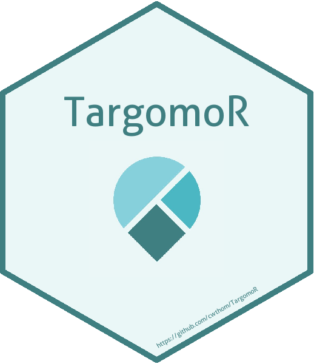
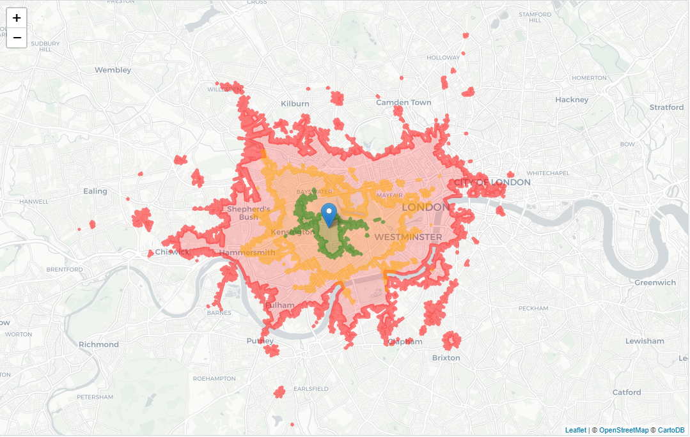

<!-- README.md is generated from README.Rmd. Please edit that file -->

# TargomoR <a href='https:/cwthom.github.io/TargomoR'></a>

The goal of TargomoR is to provide an interface to the Targomo API for
users of `leaflet` in R.

## Note

**This package is being developed with the permission of Targomo, but is
NOT AN OFFICIAL PRODUCT. For more information about Targomo, please see
their [website](https://www.targomo.com/developers/).**

**Please also be aware of the Targomo [Terms and
Conditions](https://account.targomo.com/legal/terms).**

See below for information on [installing](#installation) the package,
setting up your [environment](#set-up-environment) correctly, and
[using](#get-travel-time-data) the package.

## Installation

TargomoR is not yet on CRAN. To install this development version from
GitHub please use:

``` r
remotes::install_github("cwthom/TargomoR")
library(TargomoR)
```

## Set Up Environment

The functions in TargomoR all rely on having a Targomo API Key. To get
yours, please [sign up with
Targomo](https://targomo.com/developers/pricing/).

You’ll also need to know what region of the world to use. For example if
you’re looking for travel-time information in Germany, your region is
“westcentraleurope”. [Find your
region](https://targomo.com/developers/resources/availability/). In the
examples on this page the region is “britishisles”.

You can pass these variables to each function manually if you like, but
to avoid this, the functions will default to use the `TARGOMO_API_KEY`
and `TARGOMO_REGION` environment variables respectively.

To take advantage of this, you can set these variables in an .Renviron
file. Use the following snippet to write the variables to the file.

``` r
setTargomoVariables(api_key = "<YOUR KEY>", region = "<YOUR REGION>",
                    global = FALSE)

# global = TRUE  will write to .Renviron at Sys.getenv("HOME")
# global = FALSE will write to .Renviron at getwd()
```

Restart R for these variables to take effect.

## Get Travel Time Data

You’re now ready to use Targomo to get travel-time and routing data.
There are three services currently supported:

  - [Isochrone
    Polygons](https://targomo.com/developers/intro/services/polygon/)
  - [Routing](https://targomo.com/developers/intro/services/routing/)
  - [Time](https://targomo.com/developers/intro/services/reachability/)

For each service there are 2 core functions:

  - `getTargomo{service}` - returns an `sf` object containing the
    requested data.
  - `addTargomo{service}` - adds the polygons/routes/times to a
    `leaflet` map.

The `add*` functions are provided as a convenience - feel free to create
your own drawing functions to put the data onto a map\!

## Inputs

Each service requires basic inputs (alongside the API key and region):

  - **sources** - these are the starting points for your travel
    calculations. For the polygon service, they’re the points from which
    isochrones are calculated.
  - **targets** - not used for polygons. For the route and time
    services, these are the destination points.
  - **options** - these are travel time options to pass to the API,
    created in a call to `targomoOptions()`. This is designed to feel
    familiar to users of `leaflet` with functions like `labelOptions`
    and `popupOptions`.

#### Sources & Targets

Sources and targets are defined either by `data.frame`-like objects
(including classes exported from the `sf` package) or by vectors of
longitude and latitude coordinates. Again the syntax should feel
familiar to `leaflet` users.

For example, we could define two data frames as so:

``` r
source_data <- data.frame(id = "A", lat = 51.52, lng = -0.19)
target_data <- data.frame(id = c("X", "Y", "Z"),
                          lat = c(51.50, 51.515, 51.51), 
                          lng = c(-0.18, -0.185, -0.17))
```

#### Other Arguments

Additional optional arguments are:

  - `verbose` - FALSE by default. Should the call to the API be printed?
    Helpful for debugging.
  - `progress` - FALSE by default. Should the call mark progress with a
    progress bar? Helpful for when connections are slow or the call is
    large (many sources/targets).

## Outputs

The return value of the `getTargomo{service}` functions varies by
service. In all cases, spatial data is returned in CRS 4326.

### Polygons

For the isochrone polygon service, `getTargomoPolygons` returns a Simple
Feature Collection of 2 fields. The fields are:

  - time - the time in seconds of each isochrone
  - area - the area in square metres of the isochrone

Each feature is a POLYGON (or MULTIPOLYGON). There is one feature per
time specified in the `travelTimes` argument of `targomoOptions` - see
[options](#options) below.

``` r
polygons <- getTargomoPolygons(source_data = source_data,
                               source_lat = ~lat, source_lng = ~lng,
                               options = targomoOptions(travelType = "bike"))
polygons
```

    #> Simple feature collection with 3 features and 2 fields
    #> geometry type:  MULTIPOLYGON
    #> dimension:      XY
    #> bbox:           xmin: -0.2775 ymin: 51.477 xmax: -0.1221 ymax: 51.5611
    #> epsg (SRID):    4326
    #> proj4string:    +proj=longlat +datum=WGS84 +no_defs
    #>   time     area                       geometry
    #> 2 1800 63557558 MULTIPOLYGON (((-0.2568 51....
    #> 1 1200 25447392 MULTIPOLYGON (((-0.2343 51....
    #> 3  600  5462596 MULTIPOLYGON (((-0.207 51.5...

Using the `addTargomoPolygons` function we can add them directly to a
leaflet map:



### Routes

For the routing service, `getTargomoRoutes` returns a named nested list.
The names are the travel modes given in the `travelType` option
(specifying multiple modes will make multiple calls to the API).

Within each travel mode is a list of the returned routes - one for each
source/target combination where a route has been found. Each route is a
data.frame, containing the source and target IDs, and a `features`
data.frame of a simple feature collection (class ‘sf’). This contains:

  - points - the source and target points of the route, as POINT
    objects.
  - walk, bike, car, transit - the routes by each mode of transport
    (where requested) as LINESTRING objects.
  - transfers - points where public transport changes (e.g. change bus)
    as POINT objects.

Each SFC also contains fields giving the start and end names of the
LINESTRINGs, the length of time the section takes and the distance in
metres.

For example, for three routes by bike, the output will look
like:

``` r
routes <- getTargomoRoutes(source_data = source_data, target_data = target_data,
                           source_lat = ~lat, source_lng = ~lng,
                           target_lat = ~lat, target_lng = ~lng,
                           source_id = ~id, target_id = ~id,
                           options = targomoOptions(travelType = "bike"))

str(routes, max.level = 3, give.attr = FALSE)
```

    #> List of 1
    #>  $ bike:List of 3
    #>   ..$ :Classes 'tbl_df', 'tbl' and 'data.frame': 3 obs. of  3 variables:
    #>   .. ..$ sourceId: chr [1:3] "A" "A" "A"
    #>   .. ..$ targetId: chr [1:3] "X" "X" "X"
    #>   .. ..$ features:Classes 'sf' and 'data.frame': 3 obs. of  9 variables:
    #>   ..$ :Classes 'tbl_df', 'tbl' and 'data.frame': 3 obs. of  3 variables:
    #>   .. ..$ sourceId: chr [1:3] "A" "A" "A"
    #>   .. ..$ targetId: chr [1:3] "Y" "Y" "Y"
    #>   .. ..$ features:Classes 'sf' and 'data.frame': 3 obs. of  9 variables:
    #>   ..$ :Classes 'tbl_df', 'tbl' and 'data.frame': 3 obs. of  3 variables:
    #>   .. ..$ sourceId: chr [1:3] "A" "A" "A"
    #>   .. ..$ targetId: chr [1:3] "Z" "Z" "Z"
    #>   .. ..$ features:Classes 'sf' and 'data.frame': 3 obs. of  9 variables:

The `features` object for the first route will look like:

``` r
routes$bike[[1]]$features
#> Simple feature collection with 3 features and 8 fields
#> geometry type:  GEOMETRY
#> dimension:      XY
#> bbox:           xmin: -0.1899996 ymin: 51.50001 xmax: -0.1783915 ymax: 51.52
#> epsg (SRID):    4326
#> proj4string:    +proj=longlat +datum=WGS84 +no_defs
#>   endName sourceId   length targetId startName travelTime
#> 1  target     <NA> 2668.967     <NA>    source        841
#> 2    <NA>     <NA>       NA        X      <NA>         NA
#> 3    <NA>        A       NA     <NA>      <NA>         NA
#>                         geometry travelType   name
#> 1 LINESTRING (-0.1800094 51.5...       BIKE   <NA>
#> 2    POINT (-0.1800094 51.50003)       <NA> Target
#> 3       POINT (-0.1899996 51.52)       <NA> Source
```

Using `addTargomoRoutes` we can draw these routes nicely on the map. For
example:


### Times

For the time service, `getTargomoTimes` returns a Simple Feature
Collection of 4 fields. Each feature is a POINT (corresponding to the
target point), and the fields are:

  - sourceId, targetId - given IDs for the points, or inferred numeric
    IDs if none supplied
  - travelType - the travel mode (can supply multiple as with routes)
  - travelTime - the time taken in seconds to get from the source to the
    target

<!-- end list -->

``` r
times <- getTargomoTimes(source_data = source_data, target_data = target_data,
                         source_lat = ~lat, source_lng = ~lng,
                         target_lat = ~lat, target_lng = ~lng,
                         source_id = ~id, target_id = ~id,
                         options = targomoOptions(travelType = "bike"))
times
```

    #> Simple feature collection with 3 features and 4 fields
    #> geometry type:  POINT
    #> dimension:      XY
    #> bbox:           xmin: -0.185 ymin: 51.5 xmax: -0.17 ymax: 51.515
    #> epsg (SRID):    4326
    #> proj4string:    +proj=longlat +datum=WGS84 +no_defs
    #> # A tibble: 3 x 5
    #>   sourceId targetId travelType travelTime        geometry
    #>   <chr>    <chr>    <chr>           <int>     <POINT [°]>
    #> 1 A        X        bike              841    (-0.18 51.5)
    #> 2 A        Y        bike              268 (-0.185 51.515)
    #> 3 A        Z        bike              668   (-0.17 51.51)

We can add time data directly to the map with `addTargomoTimes`:


## Options

There are 2 different types of options - core options to pass to the
API, and drawing options to change how the result set is mapped (only
used in the `add*` functions).

### API Options

To change the options passed to the API, you use the `targomoOptions`
function within a `getTargomo{service}` call. Options are documented in
the manual pages (use `?targomoOptions`).

### Drawing Options

Each service has a drawing options function to customise how the
features appear on the map. These should be used with the `drawOptions`
argument to `addTargomo{service}`:

  - Polygon - `polygonDrawOptions()`
  - Route - `routeDrawOptions()`
  - Time - `timeDrawOptions()`

These are also all documented in the manual pages
(e.g. `?routeDrawOptions`).

## Attribution

It’s a condition of use of the Targomo services that you attribute the
travel time data to them. Full details can be found on their
[attributions
page](https://targomo.com/developers/resources/attribution/). To help
with this there are two functions in TargomoR:

  - `attributionLink` - just returns the URL of the attributions page
  - `addTargomoAttribution` - adds the attribution iframe to a leaflet
    control, for use with leaflet maps.

It is your responsibility to make sure you comply with the attribution
requirements appropriate to your plan.

## Contributing

Please note that the ‘TargomoR’ project is released with a [Contributor
Code of Conduct](CODE_OF_CONDUCT.md). By contributing to this project,
you agree to abide by its terms.
